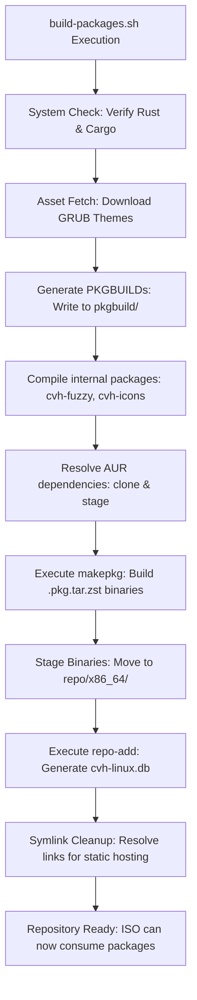

# Package Management and Build Workflow

This document explains how CodeVerse Linux manages, builds, and distributes custom packages and third-party AUR dependencies. 

## High-Level Workflow

CodeVerse Linux relies on the standard Arch Linux packaging system (`pacman` and `makepkg`). The repository is designed to automatically compile custom software, construct valid Arch Linux packages, and host them in a localized repository database. 

The entire process is orchestrated by `scripts/build-packages.sh`.

## Workflow Diagram

## Directory Structure

The package management system revolves around three core directories:

1. `src/`
   Contains the raw source code for custom software built specifically for CodeVerse Linux (e.g., `cvh-fuzzy`, `cvh-icons`).

2. `pkgbuild/`
   Contains the build formulas (`PKGBUILD` files). These files provide instructions to `makepkg` on how to compile the source code, resolve dependencies, and package the compiled binaries into a `.pkg.tar.zst` archive.

3. `repo/x86_64/`
   Acts as the localized pacman repository. This directory stores the compiled packages and the repository databases (`cvh-linux.db`, `cvh-linux.files`). The live ISO configuration treats this directory as an offline package source to pre-install custom software.

## Included Packages and Expected Behavior

The build script compiles a mix of internal projects and external AUR packages to construct the core user experience of CodeVerse Linux.

### Internal Packages
These are developed directly within the repository (source code exists in `src/` or generated via scripts) and establish the custom UI/UX of the distribution.

- **`cvh-branding`**
  - **Type:** Configuration & Theming
  - **Behavior:** This package modifies the aesthetic of the system. It installs the Tela GRUB bootloader theme, configures the `/etc/motd` terminal welcome message, and provides basic system identification details (`/usr/share/cvh-linux/info`). 
  
- **`cvh-fuzzy`**
  - **Type:** Command Line Tool (Rust)
  - **Behavior:** Acts as a universal fuzzy finder for the terminal. It provides deep shell integration (Zsh bindings like Ctrl+T and Ctrl+R for files and command history) to rapidly navigate directories and commands.

- **`cvh-icons`**
  - **Type:** Desktop Utility (Rust & Lua)
  - **Behavior:** Provides sandboxed, Lua-scriptable desktop icons tailored for the Wayland compositor. It draws interactive desktop icons and handles configurations spanning layout structure, grid sizing, and theme colors.

### External AUR Dependencies
The build system acts as an AUR helper during compilation, pulling complex dependencies that the CodeVerse stack relies upon.

- **`mpvpaper`** (and related dependencies)
  - **Type:** Wayland Tooling
  - **Behavior:** Grants the system the capability to render live video wallpapers directly onto the Wayland background surface.

## The Build Process

When `scripts/build-packages.sh` is executed, the following sequence occurs:

1. **Pre-requisite Checks**: Verifies that the Rust toolchain and standard build utilities are available.
2. **Asset Generation**: Pulls necessary UI assets, such as GRUB themes, from remote repositories and stages them according to the `1080p` display profile.
3. **PKGBUILD Generation**: Dynamically writes `PKGBUILD` files for internal project components (`cvh-branding`, `cvh-fuzzy`, `cvh-icons`) and places them inside the `pkgbuild/` subdirectories.
4. **Compilation**: Compiles custom software located in `src/` utilizing the `cargo` build system, and wraps them into Arch packages using `makepkg`.
5. **AUR Dependency Resolution**: Clones required AUR packages (like `mpvpaper`), builds them locally through `makepkg`, and stages the resulting packages alongside the internal ones.
6. **Repository Database Update**: Moves all `.pkg.tar.zst` files into `repo/x86_64/` and executes `repo-add` to construct the pacman database.

## Special Cases and Technical Considerations

### 1. Root Execution Constraints
Arch Linux's `makepkg` utility strictly prohibits execution as the root user to prevent packages from accidentally modifying the host operating system during compilation. If you are building the ISO inside a Docker container (which defaults to root), you must execute the package build process under an unprivileged user account. The provided Docker setups and continuous integration workflows handle this automatically by isolating the build environment to a standard user via `runuser`.

### 2. Symlink Resolution for Remote Hosting
By default, the `repo-add` utility creates symbolic links for the repository databases (e.g., `cvh-linux.db` points to `cvh-linux.db.tar.gz`). However, when hosting the repository via static file servers or raw repositories (such as GitHub Raw URLs), symbolic links are usually not resolved natively by the HTTP server. 

To circumvent this, the `build-packages.sh` script includes a dedicated step that explicitly removes the symbolic links and replaces them with hard file copies of the actual database tarballs. This ensures `pacman` can retrieve the databases seamlessly when pulling from an external static origin.

### 3. Modifying Built-in Packages
If you need to update a custom package or modify a `PKGBUILD`:
- Do not edit the auto-generated `PKGBUILD` files in `pkgbuild/` directly, as they will be wiped and rewritten on the next build. Instead, update the generation logic inside the `scripts/build-packages.sh` shell script.
- To add a new internal package, you must append its build logic to `scripts/build-packages.sh` and ensure its source lives inside `src/`.
- To add a new AUR package, add the package name to the array located in the `build_aur_packages` function of the build script.
- Execute `scripts/build-packages.sh` to compile any structural changes and update the corresponding hashes in the database.
